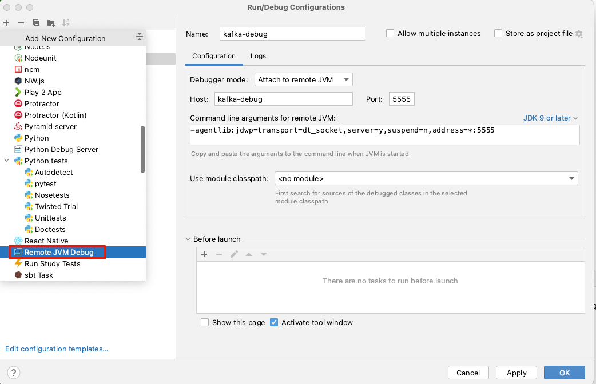

# help doc


## compile help

### Failed to connect to raw.githubusercontent.com port 443 处理方法
``` 
在https://www.ipaddress.com 查询raw.githubusercontent.com 的真实IP
访问如下地址，获取ip   
https://sites.ipaddress.com/raw.githubusercontent.com/    

在host文件中配置：
185.199.108.133 raw.githubusercontent.com

然后在次 ./gradlew srcJar（如果还是失败，换其他ip多试几次）
```


## debug broker help


### client

### broker
